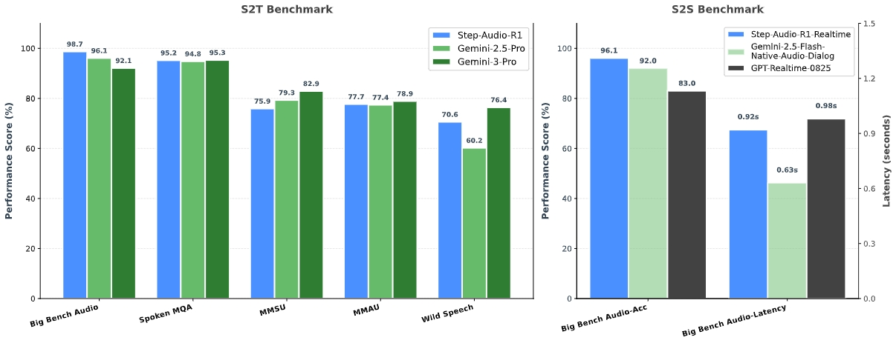
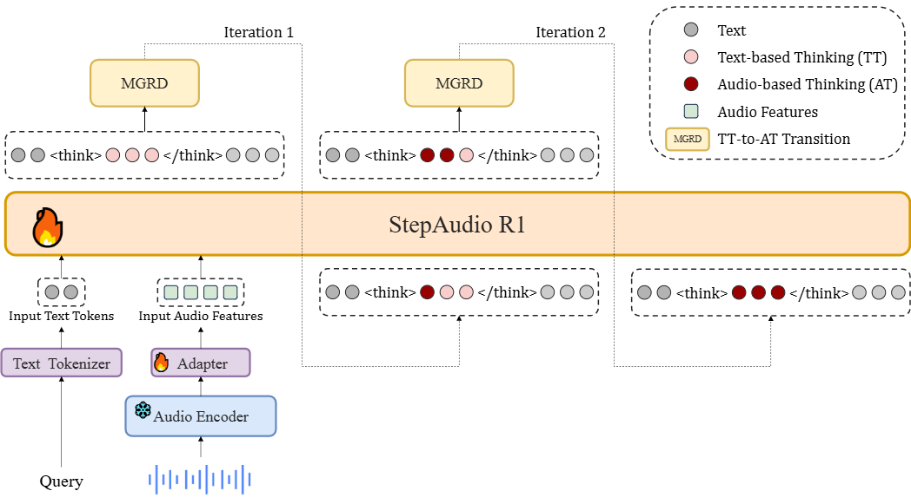
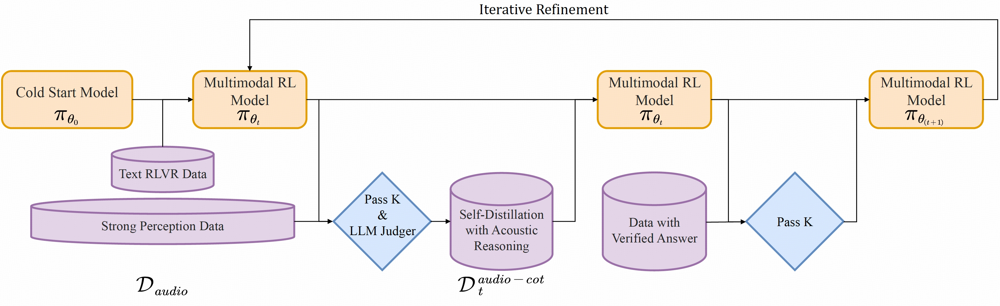

# Step-Audio-R1
<p align="center">
  
</p>

<div align="center">
    <a href="https://stepaudiollm.github.io/step-audio-r1/"></a> &ensp;
  <a href="https://arxiv.org/pdf/2511.15848"></a> &ensp;
  <a href="https://huggingface.co/stepfun-ai/Step-Audio-R1"></a> &ensp;
    <a href="https://modelscope.cn/models/stepfun-ai/Step-Audio-R1"></a> &ensp;
  <a href="https://huggingface.co/spaces/stepfun-ai/Step-Audio-R1"></a> &ensp;
</div>

## 🔥🔥🔥 News!!
* Nov 27, 2025: 🎉 We release the inference code and model weights of **Step-Audio-R1** ([HuggingFace](https://huggingface.co/stepfun-ai/Step-Audio-R1); [ModelScope](https://modelscope.cn/models/stepfun-ai/Step-Audio-R1))
* Nov 27, 2025: 🎮 We released the [HF Space Playground](https://huggingface.co/spaces/stepfun-ai/Step-Audio-R1)
* Nov 19, 2025: 🎉 We release the [Demo Page](https://stepaudiollm.github.io/step-audio-r1/) 
* Nov 19, 2025: 👋 We release the technical report of [Step-Audio-R1](Step-Audio-R1.pdf).

## 📑 Open-source Plan
- [x] Inference Code (vLLM)
- [x] Online demo (Gradio)
- [x] Model Checkpoints

## Overview

### Introduction
Step-Audio-R1 is the **first audio language model to successfully unlock test-time compute scaling**. It decisively solves the "inverted scaling" anomaly plaguing existing models, where performance paradoxically degrades with longer reasoning chains.

We identify the root cause of this failure as **Textual Surrogate Reasoning**: conventional models, due to text-based initialization, rely on linguistic abstractions (analyzing transcripts) rather than genuine acoustic properties. To resolve this modality mismatch, we introduce **Modality-Grounded Reasoning Distillation (MGRD)**, an iterative training framework that shifts the model's reasoning focus from textual surrogates to acoustic analysis.

This new approach allows us to create **Step-Audio-R1**, which:
* Is the **first audio reasoning model** that successfully benefits from test-time compute scaling.
* **Surpasses Gemini 2.5 Pro and is comparable to Gemini 3** across comprehensive audio benchmarks.
* Transforms extended deliberation from a liability into a **powerful asset** for audio intelligence.

<p align="center">
    
<p>


### Model Architecture

<p align="center">
    
<p>

Step-Audio-R1 builds on the architecture of our previous StepAudio 2 and consists of three main components:

1.  **Audio Encoder:** We use the pre-trained **Qwen2 audio encoder**. It operates at a 25 Hz frame rate and is frozen during training.
2.  **Audio Adaptor:** A simple adaptor (identical to Step-Audio 2) connects the encoder to the LLM and downsamples the feature frame rate to 12.5 Hz.
3.  **LLM Decoder:** We use **Qwen2.5 32B** as the core reasoning component. It directly takes the latent audio features from the adaptor to generate a purely textual output (first the reasoning, then the final reply).

The key innovation is our training method, **Modality-Grounded Reasoning Distillation (MGRD)**. This process iteratively refines the model's thoughts, progressively strengthening their connection to the underlying audio features until they evolve into **"native audio think."**

<p align="center">
    
<p>

This ensures the model's reasoning is not merely about the transcribed text but is deeply grounded in the **acoustic nuances** of the audio itself.

## Model Usage
### 📜 Requirements
- **GPU**: NVIDIA GPUs with CUDA support (tested on 4×L40S/H100/H800/H20).
- **Operating System**: Linux.
- **Python**: >= 3.10.0.

### ⬇️ Download Model
First, you need to download the Step-Audio-R1 model weights.

**Method A · Git LFS**
   ```bash
   git lfs install
   git clone https://huggingface.co/stepfun-ai/Step-Audio-R1
   ```

**Method B · Hugging Face CLI**
   ```bash
   hf download stepfun-ai/Step-Audio-R1 --local-dir ./Step-Audio-R1
   ```

### 🚀 Deployment and Execution
We provide two ways to serve the model: Docker (recommended) or compiling the customized vLLM backend.

#### 🐳 Method 1 · Run with Docker (Recommended)

A customized vLLM image is required.

1.  **Pull the image**:
```bash
docker pull stepfun2025/vllm:step-audio-2-v20250909
```
2.  **Start the service**:
    Assuming the model is downloaded in the `Step-Audio-R1` folder in the current directory.

    ```bash
    docker run --rm -ti --gpus all \
        -v $(pwd)/Step-Audio-R1:/Step-Audio-R1 \
        -p 9999:9999 \
        stepfun2025/vllm:step-audio-2-v20250909 \
        -- vllm serve /Step-Audio-R1 \
        --served-model-name Step-Audio-R1 \
        --port 9999 \
        --max-model-len 16384 \
        --max-num-seqs 32 \
        --tensor-parallel-size 4 \
        --chat-template '{{- content.replace("<audio_patch>\n", "<audio_patch>") -}}{{- content['"'"'value'"'"'] if '"'"'value'"'"' in content else content['"'"'text'"'"'] -}}{{- item['"'"'value'"'"'] if '"'"'value'"'"' in item else item['"'"'text'"'"'] -}}<audio_patch>{{- '"'"'<|BOT|>system\n'"'"' -}}{{- render_content(messages[0]['"'"'content'"'"']) + '"'"'<|EOT|>'"'"' -}}{{- '"'"'<|BOT|>tool_json_schemas\n'"'"' + tools|tojson + '"'"'<|EOT|>'"'"' -}}{{- '"'"'<|BOT|>system\n'"'"' + render_content(messages[0]['"'"'content'"'"']) + '"'"'<|EOT|>'"'"' -}}{{- '"'"'<|BOT|>human\n'"'"' + render_content(message["content"]) + '"'"'<|EOT|>'"'"' -}}{{- '"'"'<|BOT|>assistant\n'"'"' + (render_content(message["content"]) if message["content"] else '"'"''"'"') -}}{{- '"'"'<|EOT|>'"'"' -}}{{- '"'"'<|BOT|>'"'"' + message["role"] + '"'"'\n'"'"' + render_content(message["content"]) + '"'"'<|EOT|>'"'"' -}}{{- '"'"'<|BOT|>assistant\n<think>\n'"'"' -}}' \
        --enable-log-requests \
        --interleave-mm-strings \
        --trust-remote-code
    ```
After the service starts, it will listen on `localhost:9999`.

#### 🐳  Method 2 · Run from Source (Compile vLLM)
Step-Audio-R1 requires a customized vLLM backend.

1.  **Download Source Code**:
    ```bash
    git clone https://github.com/stepfun-ai/vllm.git
    cd vllm
    ```

2.  **Prepare Environment**:
    ```bash
    python3 -m venv .venv
    source .venv/bin/activate
    ```

3.  **Install and Compile**:
    vLLM contains both C++ and Python code. We mainly modified the Python code, so the C++ part can use the pre-compiled version to speed up the process.
    
    ```bash
    # Use pre-compiled C++ extensions (Recommended)
    VLLM_USE_PRECOMPILED=1 pip install -e .
    ```

4.  **Switch Branch**:
    After compilation, switch to the branch that supports Step-Audio.
    ```bash
    git checkout step-audio-2-mini
    ```

5.  **Start the Service**:
    ```bash
    # Ensure you are in the vllm directory and the virtual environment is activated
    source .venv/bin/activate

    python3 -m vllm.entrypoints.openai.api_server \
        --model ../Step-Audio-R1 \
        --served-model-name Step-Audio-R1 \
        --port 9999 \
        --host 0.0.0.0 \
        --max-model-len 65536 \
        --max-num-seqs 128 \
        --tensor-parallel-size 4 \
        --gpu-memory-utilization 0.85 \
        --trust-remote-code \
        --enable-log-requests \
        --interleave-mm-strings \
        --chat-template '{{- content.replace("<audio_patch>\n", "<audio_patch>") -}}{{- content['"'"'value'"'"'] if '"'"'value'"'"' in content else content['"'"'text'"'"'] -}}{{- item['"'"'value'"'"'] if '"'"'value'"'"' in item else item['"'"'text'"'"'] -}}<audio_patch>{{- '"'"'<|BOT|>system\n'"'"' -}}{{- render_content(messages[0]['"'"'content'"'"']) + '"'"'<|EOT|>'"'"' -}}{{- '"'"'<|BOT|>tool_json_schemas\n'"'"' + tools|tojson + '"'"'<|EOT|>'"'"' -}}{{- '"'"'<|BOT|>system\n'"'"' + render_content(messages[0]['"'"'content'"'"']) + '"'"'<|EOT|>'"'"' -}}{{- '"'"'<|BOT|>human\n'"'"' + render_content(message["content"]) + '"'"'<|EOT|>'"'"' -}}{{- '"'"'<|BOT|>assistant\n'"'"' + (render_content(message["content"]) if message["content"] else '"'"''"'"') -}}{{- '"'"'<|EOT|>'"'"' -}}{{- '"'"'<|BOT|>'"'"' + message["role"] + '"'"'\n'"'"' + render_content(message["content"]) + '"'"'<|EOT|>'"'"' -}}{{- '"'"'<|BOT|>assistant\n<think>\n'"'"' -}}'
    ```

After the service starts, it will listen on `localhost:9999`.


### 🧪 Client Examples

Get the example code and run it:
```bash
# Clone the repository containing example scripts
git clone https://github.com/stepfun-ai/Step-Audio-R1.git r1-scripts
cd r1-scripts

# Run the example
python examples-vllm_r1.py
```

## Citation

If you find our paper and code useful in your research, please consider giving a star :star: and citation :pencil: :)
```bash
@article{tian2025step,
  title={Step-Audio-R1 Technical Report},
  author={Tian, Fei and Zhang, Xiangyu Tony and Zhang, Yuxin and Zhang, Haoyang and Li, Yuxin and Liu, Daijiao and Deng, Yayue and Wu, Donghang and Chen, Jun and Zhao, Liang and others},
  journal={arXiv preprint arXiv:2511.15848},
  year={2025}
}
```

## Star History

[](https://star-history.com/#stepfun-ai/Step-Audio-R1&Date)

<br>
